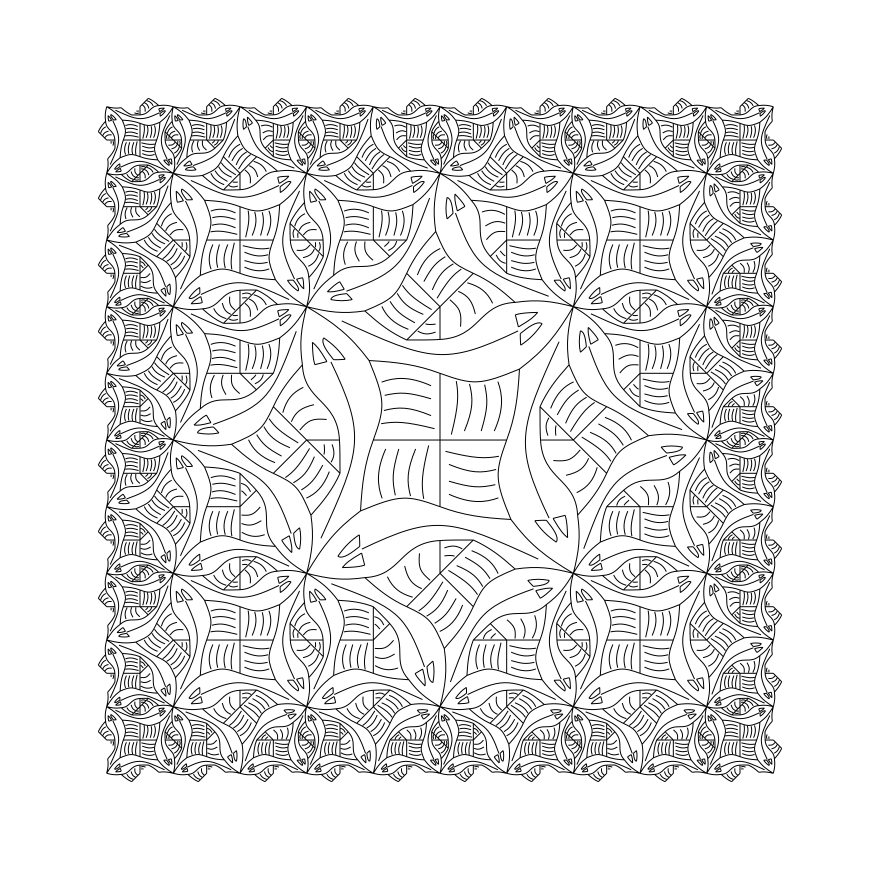

# escher-fish

Escher's *Square Limit*, drawn in Lean 4 using the algebra of pictures from Peter
Henderson's [*Functional Geometry*](https://eprints.soton.ac.uk/id/eprint/257577/1/funcgeo2.pdf) (2002).



## Running

```
lake build
.lake/build/bin/escher            # writes squarelimit.svg
.lake/build/bin/escher out.svg    # or to a path of your choosing
```

## Reading the code alongside the paper

| Paper | Lean |
| --- | --- |
| §5, a picture as a function of vectors `a`, `b`, `c`; `blank`, `over`, `beside`, `above`, `rot`, `flip`, `rot45` | [`Escher/Picture.lean`](Escher/Picture.lean) |
| Figure 4, the basic fish | [`Escher/Fish.lean`](Escher/Fish.lean) |
| §3, `fish2`, `fish3`, `t`, `u`, `quartet`, `side`, `corner`, `nonet`, `squarelimit` | [`Escher/SquareLimit.lean`](Escher/SquareLimit.lean) |
| Rendering the curves | [`Escher/Svg.lean`](Escher/Svg.lean) |

The paper's `side[n]` and `corner[n]` become functions of the depth `n`, and
`beside(m, n, p, q)` / `above(m, n, p, q)` are written `beside' m n p q` /
`above' m n p q`. Otherwise the equations read as they do in the paper:

```lean
def squarelimit (n : Nat) :=
  nonet (corner n) (side n) (rot (rot (rot (corner n))))
        (rot (side n)) u (rot (rot (rot (side n))))
        (rot (corner n)) (rot (rot (side n))) (rot (rot (corner n)))
```

## Credits

The fish's Bézier control points are Einar Høst's transcription of Henderson's
fish, from [einarwh/escher-workshop](https://github.com/einarwh/escher-workshop)
(MIT licence).
