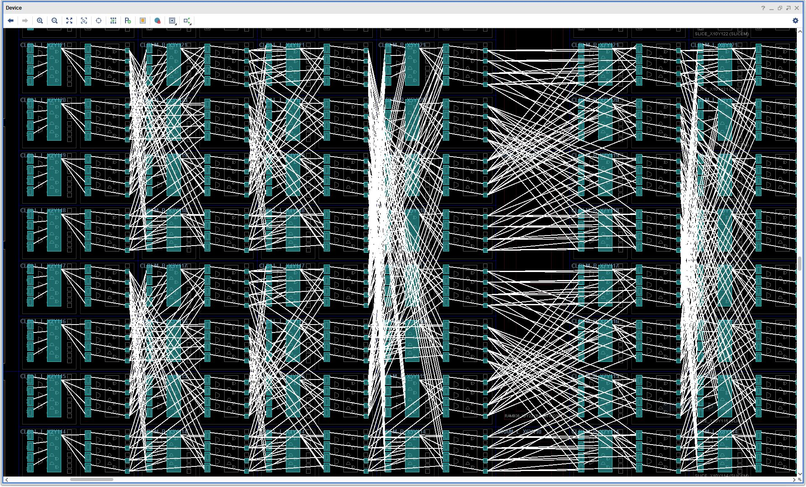

# escher-fish

I love [Escher's fish](https://en.wikipedia.org/wiki/Sky_and_Water_I), and I especially love [Peter Henderson](https://www.linkedin.com/in/peter-henderson-98a48742/)'s rendering of Escher's fish, which has inspired much of the work I have done on algebraic specification of circuit layout, building on the original work on [Ruby](https://www.cs.ox.ac.uk/people/geraint.jones/ruby/) for circuit design and layout by [Mary Sheeran](https://www.cse.chalmers.se/~ms/) and [Geraint Jones](https://www.cs.ox.ac.uk/people/geraint.jones/).

Here we have Escher's *Square Limit*, drawn in Lean 4 using the algebra of pictures from the 2002 update of Peter
Henderson's 1982 paper [*Functional Geometry*](https://eprints.soton.ac.uk/id/eprint/257577/1/funcgeo2.pdf).


And this is its beautiful description in Lean 4:

```lean
def squarelimit (n : Nat) :=
  nonet (corner n) (side n) (rot (rot (rot (corner n))))
        (rot (side n)) u (rot (rot (rot (side n))))
        (rot (corner n)) (rot (rot (side n))) (rot (rot (corner n)))
```

## Functional Geometry for Circuit Layout

Ruby, a relational hardware description language which provides combinators that simultaneously combine behavioural semantics and layout semantics, allows for the expression of sophisticated circuit layouts using just composable combinators without mentioning a single Cartesian co-ordinate. The page [A Sorter Example in Lava](https://raintown.org/lava/sorter/) gives an example of how a high speed sorter can be efficiently laid out on a Xilinx FPGA using a DSL that has layout combinators that also compose behaviour ([Lava](https://raintown.org/lava/)).

Here is what the layout of a Batcher's bitonic sorter on an FPGA produced from a DSL with layout combinators looks like:



Notice how the FFT-style butterfly wiring pattern is clearly evident. The ability to express spatial layout in a textual algebraic manner is not only great for humans, but it is also fantastic for AIs (LLMs), which can use layout combinators and their laws to help optimize circuit layouts to minimize area, delay, power, etc. The basic higher order layout combinator used to implement the sorter is a butterfly network:

```lean
/-
BFLY is a butterfly pattern that can be used to implement Batcher's bitonic merger.
A degree n=0 butterfly is the base case, applying just r on 2^(1+n) inputs ie. 2 inputs to 2 outputs.
A degree n butterfly takes 2^(1+n) inputs and produces 2^(1+n) outputs.
-/
def BFLY (r : Rel (List.Vector α 2) (List.Vector α 2)) :
    (n : Nat) → Rel (List.Vector α (2 ^ (n + 1))) (List.Vector α (2 ^ (n + 1)))
  | 0 => r
  | n + 1 =>
    have h : 2 ^ (n + 2) = 2 * 2 ^ (n + 1) := by ring
    h ▸ (ILV (BFLY r n) ⨾ EVENS r)
```

## Running

```
lake build
.lake/build/bin/escher            # writes squarelimit.svg
.lake/build/bin/escher out.svg    # or to a path of your choosing
```

## Reading the code alongside the paper

| Paper | Lean |
| --- | --- |
| §5, a picture as a function of vectors `a`, `b`, `c`; `blank`, `over`, `beside`, `above`, `rot`, `flip`, `rot45`; the utility functions `quartet` and `nonet` | [`Escher/Picture.lean`](Escher/Picture.lean) |
| Figure 4, the basic fish | [`Escher/Fish.lean`](Escher/Fish.lean) |
| §3, `fish2`, `fish3`, `t`, `u`, `side`, `corner`, `squarelimit` | [`Escher/SquareLimit.lean`](Escher/SquareLimit.lean) |
| §6, laws such as `rot(beside(p,q)) = above(rot(q),rot(p))`, proved for all pictures | [`Escher/Laws.lean`](Escher/Laws.lean) |
| Rendering the curves | [`Escher/Svg.lean`](Escher/Svg.lean) |

The paper's `side[n]` and `corner[n]` become functions of the depth `n`, and
`beside(m, n, p, q)` / `above(m, n, p, q)` are written `beside' m n p q` /
`above' m n p q`. Otherwise the equations read as they do in the paper (repeated from above):

```lean
def squarelimit (n : Nat) :=
  nonet (corner n) (side n) (rot (rot (rot (corner n))))
        (rot (side n)) u (rot (rot (rot (side n))))
        (rot (corner n)) (rot (rot (side n))) (rot (rot (corner n)))
```

Coordinates are exact rationals (`Rat`) rather than `Float`, so the laws can be
proved: floating-point addition is not even associative. Some laws hold only up to
the order in which curves are drawn; these are stated with `≈`, meaning the two
pictures draw the same curves in every locating box. For example:

```lean
theorem rot_beside : rot (beside p q) ≈ above (rot q) (rot p)
```

## More about Ruby and Lava

There are many great papers about Ruby and Lava, here is a small selection:

* [Ruby page at the University of Oxford](https://www.cs.ox.ac.uk/people/geraint.jones/ruby/)
* [Lava: hardware design in Haskell](https://dl.acm.org/doi/10.1145/289423.289440). Per Bjesse, Koen Claessen, Mary Sheeran and Satnam Singh. ICFP '98: Proceedings of the third ACM SIGPLAN international conference on Functional programming.
* [The Design and Verification of a Sorter Core](https://link.springer.com/chapter/10.1007/3-540-44798-9_28). Koen Claessen, Mary Sheeran and Satnam Singh. Correct Hardware Design and Verification Methods. CHARME 2001.
* [Extensible Embedded Hardware Description Languages with Compilation, Simulation and Verification](https://dl.acm.org/doi/10.1145/3597031.3597051). Omar Tahir, Wayne Luk and Nicolas Wu. HEART '23: Proceedings of the 13th International Symposium on Highly Efficient Accelerators and Reconfigurable Technologies.


## Credits

The fish's Bézier control points are Einar Høst's transcription of Henderson's
fish, from [einarwh/escher-workshop](https://github.com/einarwh/escher-workshop)
(MIT licence).
